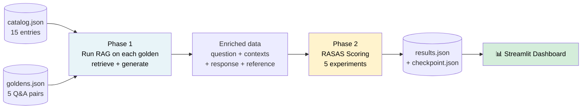
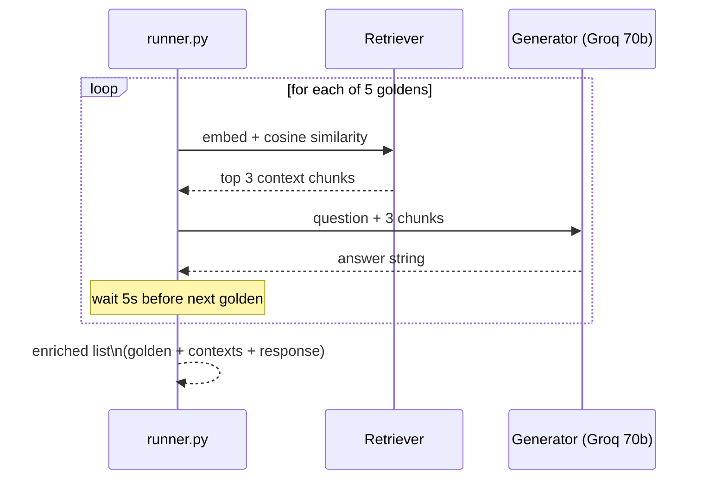
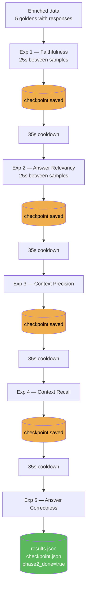
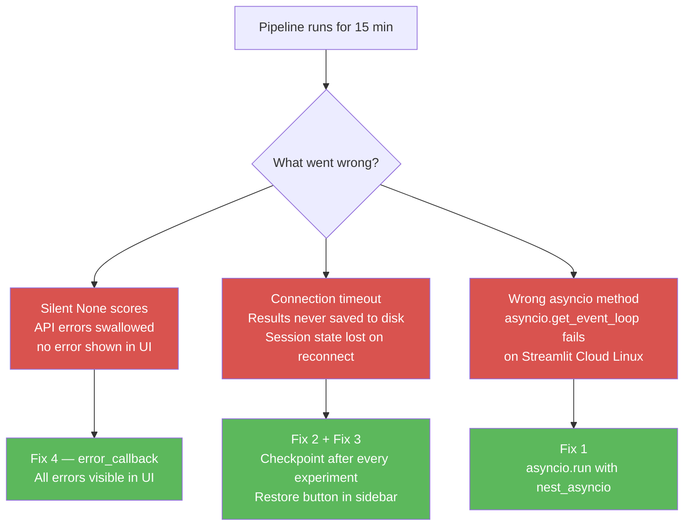
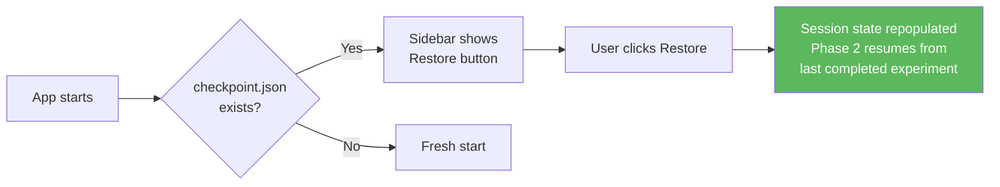

# Evaluation Pipeline — TechNest RAG

> **See also:**
> - [`README.md`](../README.md) — project overview, setup, and quick-start
> - [`EVALS.md`](../EVALS.md) — deep-dive on every metric, terminology, and token budget math
> - [`DOCS/EVALS.md`](EVALS.md) — evaluation approaches comparison and framework guide

---

## What Is This Pipeline?

Building a RAG system is not the same as knowing it works.

Think of it like a doctor running tests. You don't just *assume* the patient is healthy — you measure blood pressure, run a blood panel, check reflexes. Each test catches a specific kind of problem. Evals are those tests for your AI system.

```
Without evals → "It seems fine on the questions I tried."
With evals    → "Faithfulness: 0.87 | Context Recall: 0.91 | Answer Correctness: 0.81"
```

This pipeline runs a **real RAG system** over the TechNest product catalog, then scores it with RAGAS across 5 metrics. Everything runs in a Streamlit app with live progress, error surfacing, and automatic checkpoint recovery.



---

## The Data

### `data/catalog.json` — 15 Entries

The knowledge base the RAG retrieves from. Three categories:

| Category | Count | Examples |
|----------|-------|---------|
| `product` | 8 | ProBook X1 laptop, PixelPhone 15, SoundPods Pro, SmartWatch X, BassBuds Max… |
| `policy` | 4 | Return policy, Shipping policy, Warranty, Payment |
| `faq` | 3 | Order tracking, International shipping, Bulk orders |

Each entry has a flat schema — no nesting, no embeddings stored:
```json
{
  "id": "prod_001",
  "category": "product",
  "title": "ProBook X1 Laptop",
  "content": "14-inch, Intel i7-13th Gen, 16GB DDR5 RAM, 512GB NVMe SSD..."
}
```

### `goldens.json` — 5 Q&A Pairs

Each golden has a question and a **reference answer** (ground truth). The reference is what the RAG *should* say. We compare the actual RAG response against it using RAGAS.

```json
{
  "id": "g001",
  "metric_focus": "faithfulness",
  "user_input": "What is TechNest's return policy?",
  "reference": "Returns accepted within 30 days. Original packaging required. Customer pays return shipping unless defective."
}
```

Each golden is designed to stress-test one specific metric:

| Golden | Question | Primary metric tested |
|--------|----------|-----------------------|
| g001 | What is TechNest's return policy? | Faithfulness |
| g002 | What are the RAM and storage specs of the ProBook X1? | Answer Relevancy |
| g003 | How long is the battery life on the SoundPods Pro? | Context Precision |
| g004 | What are TechNest's shipping options and how long do returns take? | Context Recall |
| g005 | What is the price of the PixelPhone 15? | Answer Correctness |

> **Why separate goldens per metric?** Each metric measures something different. If all goldens tested the same thing, a low score wouldn't tell you *where* the pipeline is broken. One golden per metric gives you isolated, actionable signal.

---

## Phase 1 — Running the RAG Pipeline

For each golden, `evals/runner.py`:
1. Embeds the question using `sentence-transformers/all-MiniLM-L6-v2` (local, no API cost)
2. Computes cosine similarity against all 15 catalog entries
3. Returns the top 3 most similar chunks as context
4. Calls Groq `llama-3.3-70b-versatile` with the question + context to generate an answer
5. Waits 5 seconds between calls (Groq RPM buffer)



**Output:** enriched list — each golden now has `retrieved_contexts` and `response` filled in.

**Checkpoint saved here** → if Phase 1 completes and Phase 2 is interrupted, the enriched data is not lost.

---

## Phase 2 — RAGAS Scoring

`evals/metrics.py` runs 5 RAGAS experiments against the enriched data. Each experiment scores all 5 goldens on one metric.



### The 5 Metrics

| # | Metric | What it checks | What it needs |
|---|--------|----------------|---------------|
| 1 | **Faithfulness** | Does the answer only use facts from the retrieved context? | question + response + contexts |
| 2 | **Answer Relevancy** | Does the answer actually address the question asked? | question + response |
| 3 | **Context Precision** | Are the most useful chunks ranked at the top? | question + reference + contexts |
| 4 | **Context Recall** | Did retrieval fetch everything the reference answer needs? | question + contexts + reference |
| 5 | **Answer Correctness** | Does the answer match the ground truth reference? | question + response + reference |

For the full metric breakdown, score thresholds, and token-by-token cost analysis → [`EVALS.md`](../EVALS.md)

---

## Rate Limit Strategy

RAGAS uses `llama-3.1-8b-instant` as the judge LLM via Groq. The free-tier limit is **6,000 TPM** (tokens per minute). Each scoring call bursts ~1,100 tokens. Without pacing, the second or third call will hit the rate limit.

### The Math

```
After firing sample 1 (~1,100 tokens consumed):
  Wait 25s → window recovers: 1,100 × (25/60) = ~458 tokens back
  Remaining in window: 1,100 - 458 = 642 tokens

Fire sample 2 → 642 + 1,100 = 1,742 tokens in window → safely under 6,000 ✅

After all 5 samples:
  Wait 35s → the 60s TPM window fully resets to 0
  Next experiment starts with a clean slate ✅
```

### Timing Constants

| Constant | Value | Purpose |
|----------|-------|---------|
| `SAMPLE_COOLDOWN` | 25s | Between samples within one experiment |
| `EXPERIMENT_COOLDOWN` | 35s | Between experiments — fully resets window |
| `RETRY_WAIT` | 65s | Wait after a 429 before retrying once |
| `CONTEXT_CHARS` | 400 | Max chars per context chunk passed to metric |
| `CONTEXT_LIMIT` | 2 | Max context chunks passed per call |

> Context truncation matters: without it, a Faithfulness call with long product descriptions can exceed 6,000 tokens in a single call and always 429.

### Two Groq Keys

| Key | Used for | Why separate? |
|-----|----------|---------------|
| `GROQ_API_KEY` | Phase 1 RAG generation (`llama-3.3-70b`) | Production traffic — must not be exhausted |
| `JUDGE_GROQ` | Phase 2 RAGAS judge (`llama-3.1-8b-instant`) | Eval runs have different burst patterns |

If both used the same key, a 15-minute eval run could rate-limit the live application mid-conversation. If `JUDGE_GROQ` is not set, the app falls back to `GROQ_API_KEY` automatically.

**Expected runtime for 5 goldens:**
- Phase 1: ~1 min
- Phase 2: ~12–15 min
- Total: ~13–16 min

---

## Bulletproof on Streamlit Cloud

When we first deployed this, the pipeline ran but the Results tab showed nothing. Three things went wrong:



### Fix 1 — Use `asyncio.run()` not `get_event_loop()`

On Streamlit Cloud (Linux), Streamlit may own the running event loop. Calling `asyncio.get_event_loop().run_until_complete()` returns a broken or already-running loop, causing silent failures.

```python
# ❌ Before — breaks on Streamlit Cloud
def _run(coro):
    loop = asyncio.get_event_loop()
    return loop.run_until_complete(coro)

# ✅ After — works everywhere with nest_asyncio applied at startup
def _run(coro):
    return asyncio.run(coro)
```

### Fix 2 — Checkpoint after every experiment

Phase 2 takes 12–15 minutes. Streamlit Cloud can drop browser connections during long runs. We now write `checkpoint.json` after Phase 1 and after every individual experiment:

```
Phase 1 done          → checkpoint.json  { enriched, phase1_done: true }
Faithfulness done     → checkpoint.json  { enriched, scores: { Faithfulness: [...] } }
Answer Relevancy done → checkpoint.json  { enriched, scores: { Faithfulness, Answer Relevancy } }
...
All done              → checkpoint.json + results.json both saved
```

If the connection drops after experiment 3, experiments 1–3 are safe. Nothing needs to rerun.

### Fix 3 — One-click restore from the sidebar

When the app loads it checks for `checkpoint.json`. If a partial run is found, a **Restore from checkpoint** button appears. Clicking it loads everything back into session state and Phase 2 resumes automatically — already-completed experiments are skipped.



### Fix 4 — Surface errors in the UI

Every `abatch_score()` call now has an `error_callback`. When a sample fails (rate limit, timeout, connection error), the error is shown as a warning in the app — not silently swallowed as `None`.

```
Before: sample fails → score = None → Results tab shows ⬜ N/A → no idea why

After:  sample fails → ⚠️  "Sample 3: 429 rate limit hit — waiting 65s then retrying…"
                     → retries once automatically
                     → if retry also fails → ⚠️  "Retry also failed: …" shown in UI
```

### Fix 5 — Show partial results live

The Results tab no longer waits for all 5 experiments. It shows whatever scores exist in session state, updating after each experiment. 3 out of 5 done → 3 columns filled, 2 as N/A.

### Summary

| File | What changed |
|------|-------------|
| `app.py` | `_run()` uses `asyncio.run()` — checkpoint saved after every experiment — sidebar restore button — skip completed experiments on resume — partial results shown live — errors shown as warnings |
| `evals/metrics.py` | `_score_one()` accepts `error_callback` — errors named and surfaced — retry logic visible in UI |

---

## Streamlit App — 4 Tabs

| Tab | What it shows | Key interactions |
|-----|---------------|-----------------|
| 📚 **Catalog** | All 15 knowledge base entries, filterable by category | Filter by product / policy / faq |
| 🎯 **Goldens** | The 5 Q&A pairs with reference answers | Expandable per golden |
| 🚀 **Run Evaluation** | Phase 1 + Phase 2 with live progress | Run Phase 1 button → Run Phase 2 button |
| 📊 **Results** | Metric averages + per-golden score table + detail view | Download results.json |

The **sidebar** always shows session status and the checkpoint restore button when applicable.

---

## How to Run

```bash
# Install dependencies
pip install -r requirements.txt

# Add keys to .env
# GROQ_API_KEY=<main key>
# JUDGE_GROQ=<judge key>

# Start the app
streamlit run app.py
```

Navigate to `http://localhost:8501`.

1. Click **Run Phase 1** — takes ~1 min
2. Click **Run Phase 2** — takes ~12–15 min
3. View scores in the **Results** tab
4. Download `results.json` if needed

> **If the connection drops:** use the **Restore from checkpoint** button in the sidebar.

---

## File Reference

| File | Role |
|------|------|
| `app.py` | Streamlit UI — orchestrates everything |
| `rag/loader.py` | Loads `catalog.json` and `goldens.json` |
| `rag/retriever.py` | Sentence-transformers cosine similarity retrieval |
| `rag/generator.py` | Groq `llama-3.3-70b-versatile` answer generation |
| `evals/runner.py` | Phase 1 — runs RAG on each golden with spacing |
| `evals/metrics.py` | Phase 2 — RAGAS scoring with cooldowns, retry, error callback |
| `evals/reporter.py` | Builds results dict, saves JSON, prints summary |
| `data/catalog.json` | 15-entry TechNest knowledge base |
| `goldens.json` | 5 golden Q&A pairs |
| `checkpoint.json` | Auto-created — stores partial progress |
| `results.json` | Final output — created when Phase 2 completes |

---

## See Also

- [`README.md`](../README.md) — project overview, setup instructions, data tables, and the full bulletproof section with diagrams
- [`EVALS.md`](../EVALS.md) — every metric explained in depth, token budget math, evaluation approaches comparison, RAGAS 0.4.3 API rules
- [`DOCS/EVALS.md`](EVALS.md) — framework comparison (RAGAS vs DeepEval vs TruLens vs LangSmith), when to use which
- [`evals.ipynb`](../evals.ipynb) — learn all 6 RAGAS metrics in isolation with mock data before running the live pipeline
