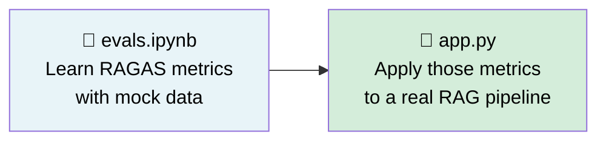
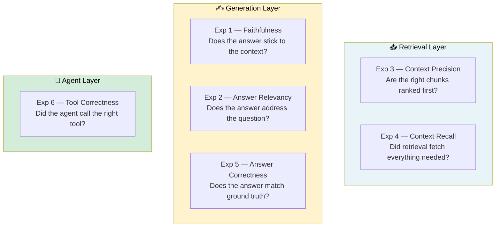
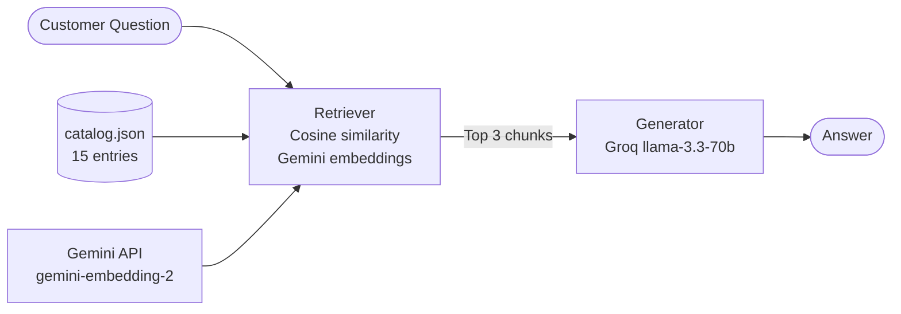
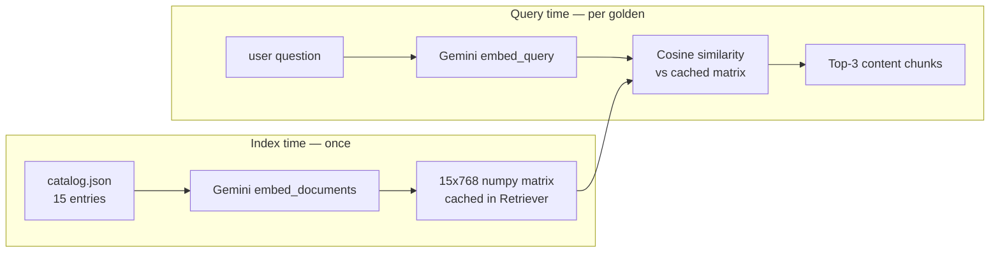
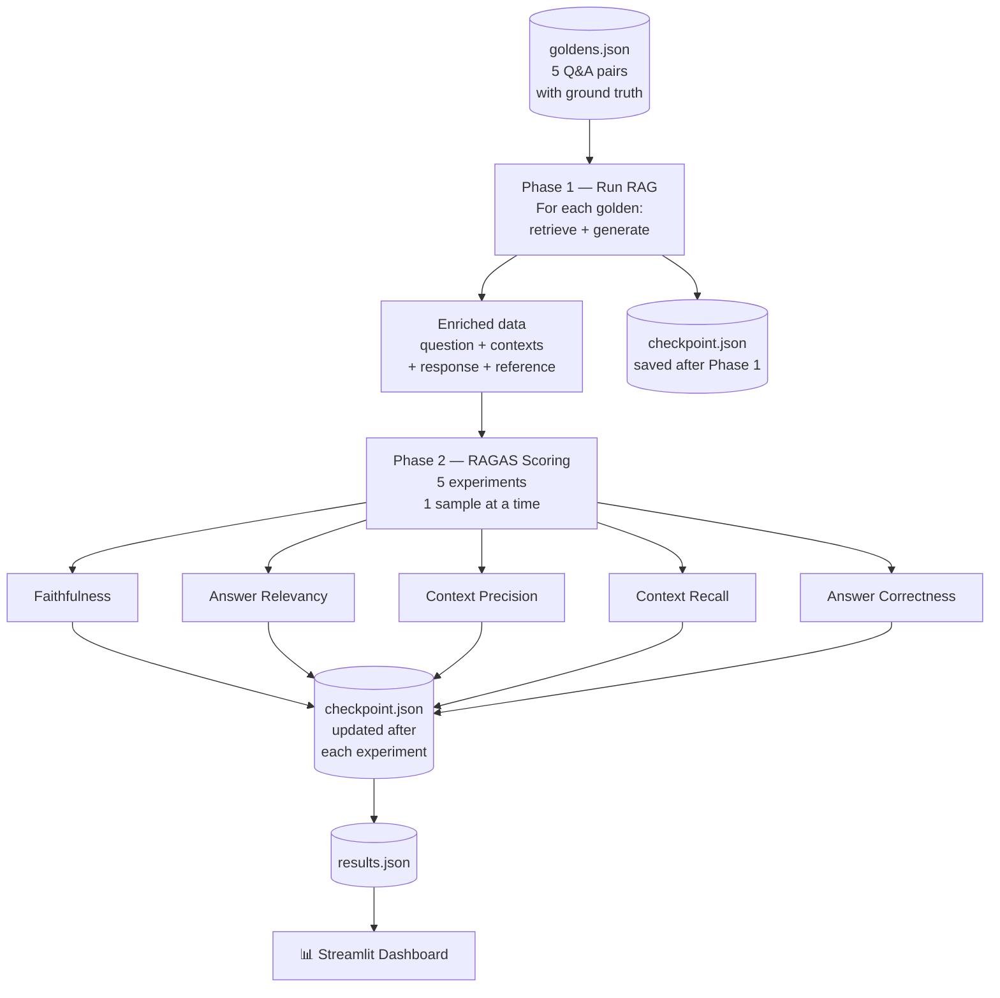
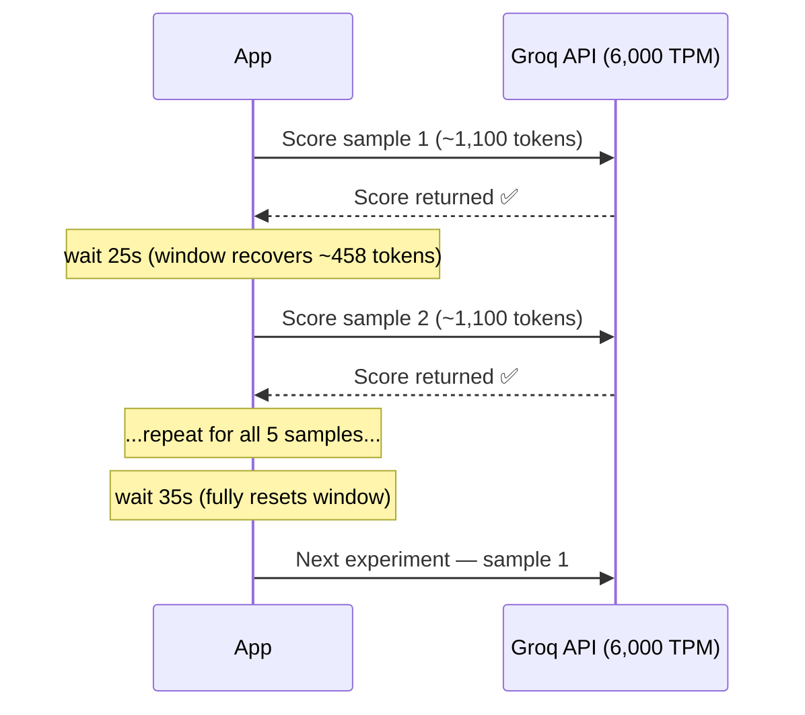
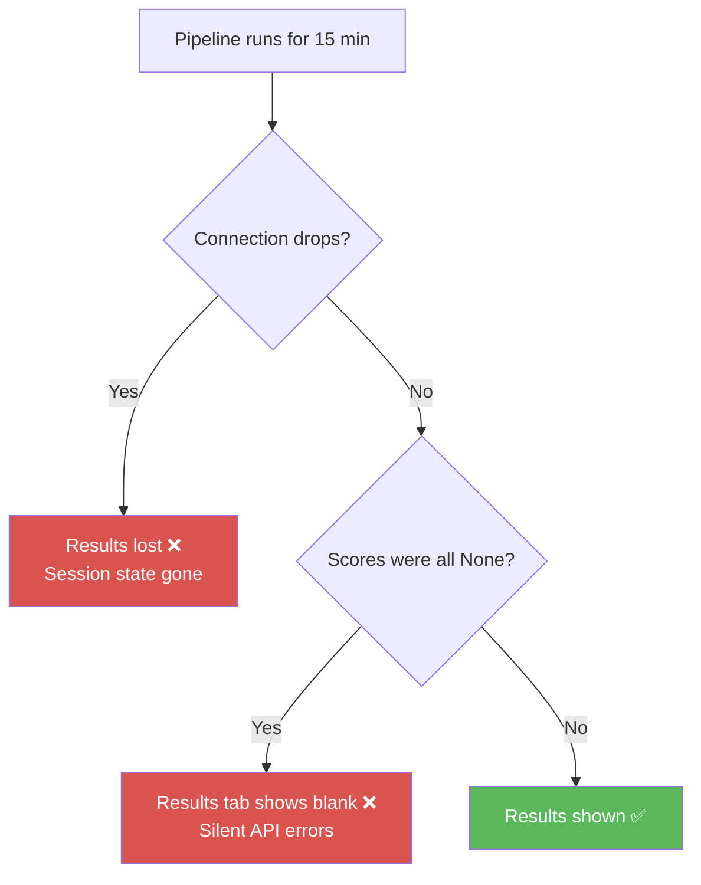
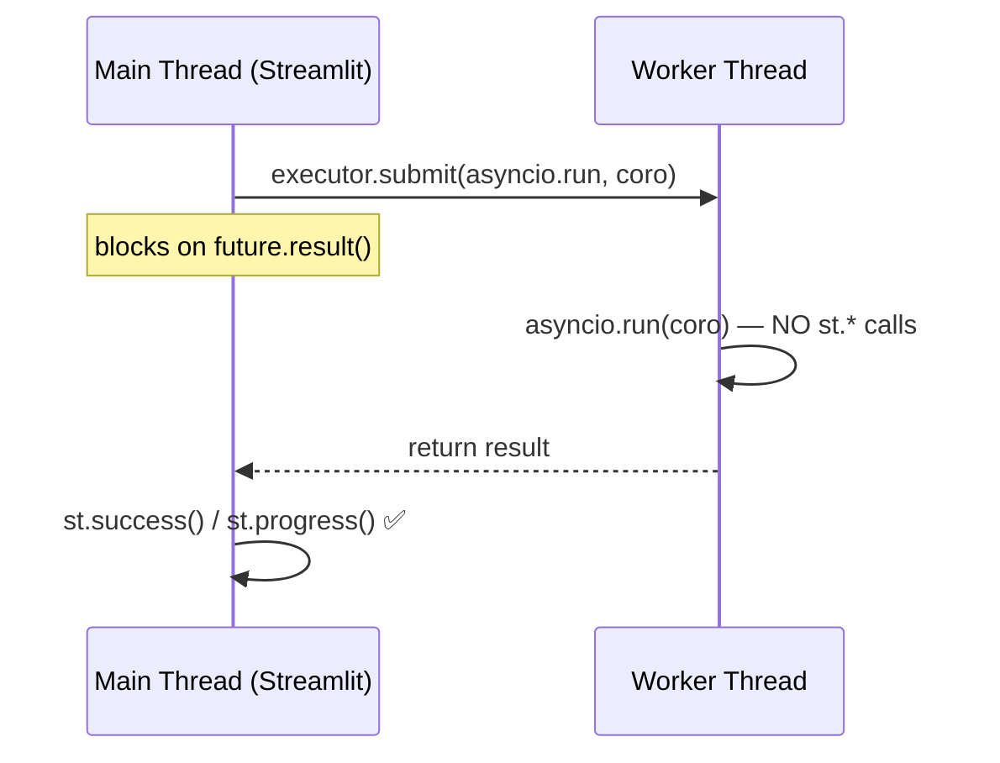
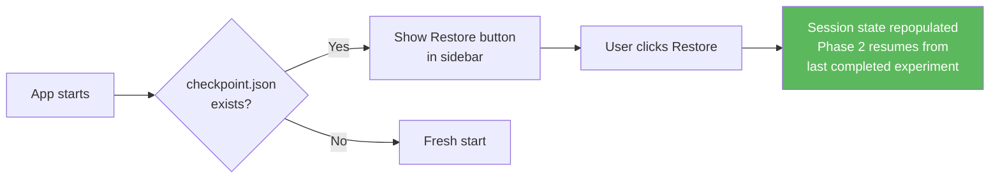
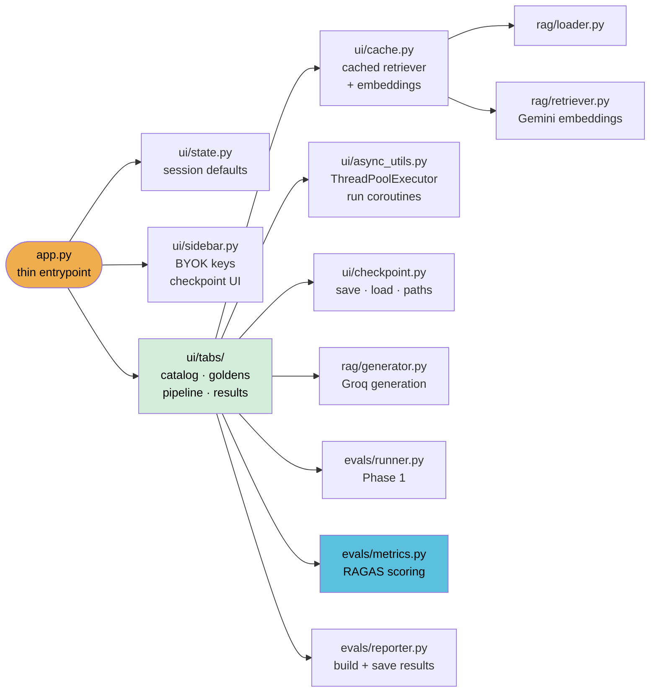

# 🛒 TechNest — RAG Evaluation Pipeline

> **One sentence:** Build a small RAG system over a product catalog, then measure exactly how well it performs using RAGAS across 5 metrics — and deploy it confidently on Streamlit Cloud.


---

## What Are Evals and Why Do They Matter?

When you build a RAG system, you can look at a few answers and say *"looks good."* But that is not good enough. What if it quietly invents facts? What if the retriever fetches the wrong documents? What if the answer completely ignores the question?

**Evals (evaluations)** are automated tests that give you a number for each of those failure modes — before your users discover the problems.

```
Without evals → "It seems fine."
With evals    → "Faithfulness: 0.87  |  Context Recall: 0.91  |  Answer Correctness: 0.81"
```

You go from guessing to measuring.

---

## Project Overview

This project has two parts that build on each other:



| Part | File | What it does |
|------|------|-------------|
| **1. Learning notebook** | `evals.ipynb` | Teaches each RAGAS metric in isolation using hand-crafted examples |
| **2. Live demo** | `app.py` | Runs a real RAG pipeline on a product catalog, then evaluates it end-to-end |

---

## Part 1 — The Notebook (`evals.ipynb`)

The notebook runs **6 experiments**, each isolating one specific thing that can go wrong in a RAG pipeline.



### The 6 Experiments at a Glance

| # | Domain | Metric | What the bad sample does |
|---|--------|--------|--------------------------|
| 1 | 🛒 E-commerce Returns | **Faithfulness** | Answer says "free return shipping" when context says customer pays |
| 2 | ✈️ Japan Travel | **Answer Relevancy** | Answer talks about food when user asked about a rail pass |
| 3 | 💻 Python Coding | **Context Precision** | Useful chunk is buried under 2 irrelevant chunks |
| 4 | 🍳 Cooking / Recipes | **Context Recall** | Context has pasta trivia but no cooking instructions |
| 5 | 🌍 General Knowledge | **Answer Correctness** | Answer says Venus is closest to the Sun, not Mercury |
| 6 | 🏠 Smart Home Agent | **Tool Correctness** | Agent calls the lights tool when user asked for music |

### How Each Metric is Scored

| Metric | Needs ground truth? | Uses LLM judge? | Uses embeddings? |
|--------|:-------------------:|:---------------:|:----------------:|
| Faithfulness | ❌ | ✅ | ❌ |
| Answer Relevancy | ❌ | ✅ | ✅ |
| Context Precision | ✅ | ✅ | ❌ |
| Context Recall | ✅ | ✅ | ❌ |
| Answer Correctness | ✅ | ✅ | ✅ |
| Tool Correctness | ❌ | ❌ (Jaccard math) | ❌ |

### Score Thresholds

| Score | Meaning | Action |
|-------|---------|--------|
| ≥ 0.75 | 🟢 Good | Safe to ship |
| 0.50 – 0.74 | 🟡 Fair | Investigate |
| < 0.50 | 🔴 Poor | Fix before shipping |

### Tech Stack (Notebook)

| Component | What we use |
|-----------|-------------|
| LLM judge | `llama-3.1-8b-instant` via Groq |
| Embeddings | `sentence-transformers/all-MiniLM-L6-v2` (local, free) |
| Eval library | RAGAS 0.4.3 |
| Async client | `openai.AsyncOpenAI` pointed at Groq's API |

---

## Part 2 — The Live Demo (`app.py`)

A Streamlit app that runs a **real** RAG pipeline over a TechNest product catalog and then evaluates it with RAGAS.

### The RAG Pipeline



**How retrieval works:**



### The Evaluation Pipeline



### Rate Limit Strategy

RAGAS calls the Groq judge LLM many times. With a **6,000 TPM** free-tier limit on `llama-3.1-8b-instant`, we need to pace the calls carefully.



| Setting | Value | Why |
|---------|-------|-----|
| Samples at a time | 1 | Prevents burst exceeding 6,000 TPM |
| Sample cooldown | 25s | Partially resets the 60s TPM window |
| Experiment cooldown | 35s | Fully resets before next metric starts |
| Context truncation | 400 chars / 2 chunks | Keeps tokens per call predictable |
| 429 retry wait | 65s | Gives Groq's window time to fully clear |

**Expected runtime for 5 goldens: ~12–15 minutes** for Phase 2.

---

## Making It Bulletproof on Streamlit Cloud

When we first deployed this on Streamlit Cloud, the pipeline ran but the Results tab showed nothing. Here is exactly what went wrong and the 5 fixes we applied.

### What Went Wrong

**Problem 1 — Silent failures:** When the Groq API returned a rate limit error or a timeout, the scoring function quietly returned `None` instead of showing what happened. The pipeline appeared to finish, but every score was blank.

**Problem 2 — Connection timeout:** Phase 2 takes 12–15 minutes. Streamlit Cloud drops the browser connection after long-running requests. When the connection resumed, the results were gone because they had never been saved to disk.

**Problem 3 — Wrong async method:** We were using `asyncio.get_event_loop().run_until_complete()` to run async code from Streamlit's sync context. On Streamlit Cloud (Linux), Streamlit owns the event loop in that thread — calling `get_event_loop()` returned an event loop that was already running or in a broken state, causing silent failures.



### The 5 Fixes

#### Fix 1 — Run async code in a worker thread, never touch Streamlit's event loop

```python
# ❌ BEFORE — nest_asyncio.apply() patches asyncio globally
# Breaks Streamlit's anyio loop on Python 3.12+ → NoEventLoopError
import nest_asyncio
nest_asyncio.apply()

# ✅ AFTER — isolated worker thread owns its own fresh event loop
def _run(coro):
    with concurrent.futures.ThreadPoolExecutor(max_workers=1) as executor:
        future = executor.submit(asyncio.run, coro)
        return future.result(timeout=1800)
```

The worker thread creates its own `asyncio.run()` event loop. Streamlit's internal `anyio` loop is never touched. The main thread simply blocks on `future.result()` until the work is done.

**Rule:** nothing inside the worker thread (inside `_run()`) can call `st.*`. All UI updates — `st.success()`, `st.progress()` — happen in the main thread after `_run()` returns.



---

#### Fix 2 — Save a checkpoint after every experiment

Instead of only saving results when everything is done, we write `checkpoint.json` to disk after each experiment completes.

```
Phase 1 done     → checkpoint.json saved  (has enriched RAG responses)
Faithfulness done → checkpoint.json updated (has 1/5 scores)
Answer Relevancy  → checkpoint.json updated (has 2/5 scores)
...
All done          → checkpoint.json + results.json both saved
```

If the browser disconnects after experiment 3, experiments 1–3 are safe on disk. You don't have to restart from scratch.

---

#### Fix 3 — One-click restore from the sidebar

When the app loads, it checks for `checkpoint.json`. If a previous partial run is found, a **Restore from checkpoint** button appears in the sidebar. Clicking it loads everything back into session state and Phase 2 resumes from where it left off — skipping already-completed experiments automatically.



---

#### Fix 4 — Surface errors in the UI instead of hiding them

Every scoring call now uses an `error_collector` (a plain Python list). When a sample fails (rate limit, timeout, or any other API error), the error is appended to the list inside the worker thread, then displayed as a visible warning in the main thread — not silently swallowed.

```
Before: sample 3 fails silently → score = None → Results tab shows ⬜ N/A → no idea why
After:  sample 3 fails → ⚠️  "Sample 3: 429 rate limit hit — waiting 65s then retrying…"
                       → retries once automatically
                       → if retry also fails → ⚠️  "Retry also failed: …" shown in UI
```

---

#### Fix 5 — Show partial results while Phase 2 is still running

The Results tab no longer waits for all 5 experiments to finish. It shows whatever scores are available, updating live as each experiment completes. If 3 out of 5 are done, you see 3 columns filled and 2 as N/A — not a blank page.

---

### Summary of Changes

| File | What changed |
|------|-------------|
| `app.py` | `_run()` uses `ThreadPoolExecutor` — checkpoint save after every experiment — sidebar restore button — skip completed experiments on resume — partial results shown live — errors displayed as warnings |
| `evals/metrics.py` | `_score_one()` accepts `error_collector` list — errors appended and surfaced instead of silently returning `None` — retry logic visible in UI |

---

## Code Structure

```
DMT delete it/
│
├── 📓 evals.ipynb              ← Part 1: learn RAGAS metrics with mock data
├── 🎛️  app.py                  ← Part 2: minimal entrypoint (~35 lines), wires ui/ together
│
├── ui/                        ← Streamlit UI layer (all st.* calls live here)
│   ├── state.py               ← init_session_state() — defaults + load_dotenv()
│   ├── sidebar.py             ← render_sidebar() — BYOK keys + checkpoint restore/clear
│   ├── cache.py               ← @st.cache_resource wrappers (catalog, retriever, embeddings)
│   ├── async_utils.py         ← run() — ThreadPoolExecutor wrapper for async coroutines
│   ├── checkpoint.py          ← save_checkpoint(), load_checkpoint(), path constants
│   └── tabs/
│       ├── catalog.py         ← render_catalog_tab()
│       ├── goldens.py         ← render_goldens_tab()
│       ├── pipeline.py        ← render_pipeline_tab() — Phase 1 + Phase 2 runner
│       └── results.py         ← render_results_tab() — averages, table, download
│
├── data/
│   └── catalog.json           ← 15 TechNest entries (products + policies + FAQs)
│
├── goldens.json               ← 5 Q&A pairs with reference answers
│
├── rag/                       ← RAG pipeline modules
│   ├── loader.py              ← load catalog.json and goldens.json
│   ├── retriever.py           ← Gemini embeddings, cosine similarity, return top-k chunks
│   └── generator.py          ← call Groq LLM, return answer string
│
├── evals/                     ← Evaluation modules
│   ├── runner.py              ← Phase 1: run RAG on each golden
│   ├── metrics.py             ← Phase 2: RAGAS scoring with cooldowns + retry + error surfacing
│   └── reporter.py            ← build results dict, save JSON, print summary
│
├── svgs/                      ← Flow diagrams for every micro-workflow (10 SVGs)
│   ├── 01_system_overview.svg
│   ├── 02_rag_retrieval.svg
│   ├── 03_rag_generation.svg
│   ├── 04_phase1_pipeline.svg
│   ├── 05_phase2_evaluation.svg
│   ├── 06_thread_safety.svg
│   ├── 07_rate_limit_strategy.svg
│   ├── 08_checkpoint_recovery.svg
│   ├── 09_ragas_metrics.svg
│   └── 10_byok_sidebar.svg
│
├── checkpoint.json            ← auto-created during a run, safe to delete
├── results.json               ← final eval results (created after Phase 2 completes)
│
├── EVALS.md                   ← Deep-dive reference: all metrics explained
├── README.md                  ← this file
├── requirements.txt
└── .env                       ← GROQ_API_KEY, JUDGE_GROQ, GEMINI_API_KEY (never committed)
```

### Module Responsibilities



---

## Setup

### 1. Install dependencies

```bash
pip install -r requirements.txt
```

### 2. Add API keys to `.env`

```
GROQ_API_KEY=<your main Groq key>
JUDGE_GROQ=<second Groq key — used only for RAGAS judge calls>
GEMINI_API_KEY=<your Google AI Studio key>
```

> **Why three keys?**
> - `GROQ_API_KEY` — RAG generator (`llama-3.3-70b-versatile`)
> - `JUDGE_GROQ` — RAGAS judge LLM (`llama-3.1-8b-instant`). Keeping it separate means eval can never exhaust your main key. Falls back to `GROQ_API_KEY` if blank.
> - `GEMINI_API_KEY` — Gemini retrieval embeddings (`gemini-embedding-2-preview`). Free key at [aistudio.google.com](https://aistudio.google.com).

On Streamlit Cloud, enter these keys in the **BYOK sidebar** — they are stored in the browser session only, never on disk.

### 3. Run the notebook (Part 1)

Open `evals.ipynb` in Jupyter or VS Code and run all cells top to bottom.

### 4. Run the Streamlit demo (Part 2)

```bash
streamlit run app.py
```

Then follow the 4 tabs:

| Tab | What to do |
|-----|-----------|
| 📚 Catalog | Browse the 15-entry knowledge base |
| 🎯 Goldens | Review the 5 Q&A pairs with ground truth |
| 🚀 Run Evaluation | Click **Run Phase 1**, then **Run Phase 2** |
| 📊 Results | View metric scores + download `results.json` |

> **If the connection drops mid-run:** use the **Restore from checkpoint** button in the sidebar. Phase 2 will resume from the last completed experiment automatically.

---

## The Data

### `data/catalog.json` — 15 entries

| Category | Count | Examples |
|----------|-------|---------|
| `product` | 8 | ProBook X1 laptop, PixelPhone 15, SoundPods Pro, SmartWatch X… |
| `policy` | 4 | Return policy, Shipping policy, Warranty, Payment |
| `faq` | 3 | Order tracking, International shipping, Bulk orders |

### `goldens.json` — 5 Q&A pairs

Each golden is designed to stress-test a specific metric:

| Golden | Question | Targets |
|--------|----------|---------|
| g001 | What is TechNest's return policy? | Faithfulness |
| g002 | What are the RAM and storage specs of the ProBook X1? | Answer Relevancy |
| g003 | How long is the battery life on the SoundPods Pro? | Context Precision |
| g004 | What are TechNest's shipping options and how long do returns take? | Context Recall |
| g005 | What is the price of the PixelPhone 15? | Answer Correctness |

---

## Further Reading

- [`EVALS.md`](EVALS.md) — deep-dive on every metric, token budget math, all terminology explained
- [RAGAS docs](https://docs.ragas.io) — official RAGAS documentation
- [Groq rate limits](https://console.groq.com/docs/rate-limits) — current TPM/RPM/TPD limits per model
